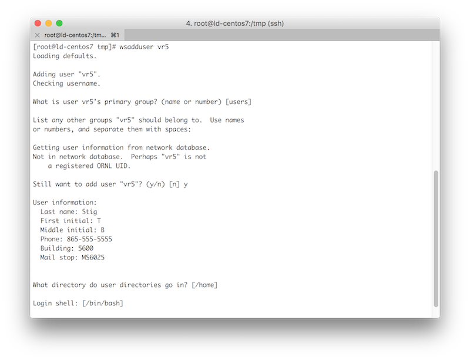

# Privileged Users
---
## Before You Begin

### 1. Review the list of systems where you have privileged access.
- [ ] The [Privileged Access Report](https://portal02.ornl.gov/sites/BI/_layouts/ReportServer/RSViewerPage.aspx?rv:RelativeReportUrl=/sites/bi/dashboards/deviceswprivaccess.rdl) will show you where you have privileged access on servers and identify the overall system administrator in case you need assistance switching to a secondary account.
- [ ] Remove your privileged access (sudo and alternate root accounts) from all computers where it is not absolutely needed.
- [ ] If you need only a limited set of privileges on a server — but not full root — remove your full privileges and grant access to the limited set of commands with sudo rules.
- [ ] If there are remaining Workstations PZ servers where you need full root privileges, continue with the steps below.

<br />
## Prepare Your Account

### 1. Obtain a secondary UCAMS account dedicated to administering servers in the Workstations PZ.
- [ ] You can request a secondary UCAMS account by contacting the Solution Center (solution@ornl.gov or 865-241-6765). Please indicate that you need the "Unix/Linux for RAN" function under the "IT Privileged Access" resource as part of this request.
- [ ] If you already have a secondary account that can be dedicated to administering servers in the Workstations PZ, then request the "Unix/Linux for RAN" function under the "IT Privileged Access" resource in [UCAMS](https://ucams.ornl.gov) for that account and follow the instructions.
- [ ] You might need to respond to multiple notifications to resend your UCAMS password.

### 2. Test your access to the Workstations PZ jump servers.
- [ ] [Configure](../home#ssh-secure-shell) your SSH client to use SmartCard authentication when connecting to SmartCard enforced computers.
- [ ] Attempt to SSH to ranlogin01.ornl.gov using your Workstations PZ privileged account.

### 3. Add your secondary account to every Workstations PZ server where you require privileged access. You may need the system administrator to assist with these steps.
- [ ] Login to the server where you need privileges.
- [ ] Elevate to root using 'su -' or 'sudo -i' as appropriate for your configuration.
	- [ ] If you are unable to gain access, SSH to a Workstations PZ jump server and then SSH as root into the target server.
- [ ] Run: wsadduser <your-ucams-secondary-userid>
- [ ] When prompted that the user is not in the network database, type **y** to continue and manually enter the user details.

- [ ] It may take up to 60 minutes for the local privileged access group to refresh with the newly added users.
	- [ ] To force an immediate refresh of your system configuration: ```/var/wscfengine3/bin/cf-agent -K```

<br />
## Use Your Account

### 1. Use your secondary account for system administration.
- [ ] SSH directly to the target server using [SmartCard authentication](../home#ssh-secure-shell) or use a Workstations PZ jump server (followed by an SSH to the target server with your password). Use your secondary account in both cases.
- [ ] Your secondary account will have full sudo privileges.

### 2. Cleanup privileged access assigned to your primary account.
**IMPORTANT:** Do not follow these steps until after you have tested that your secondary userid has full privileges on the target server.

- [ ] Remove full sudo rights form your primary userid or ask the system administrator to do it for you. This may involve removing the user from the sudo or wheel groups.
- [ ] It is recommended that you remove any alternate root accounts that are associated with your userid and use sudo instead.
- [ ] If you have any remaining primary or alternate root accounts that sync the password with your UCAMS userid (e.g. they contain [usr] in the GECOS field) change the username in the bracketed string to be your secondary userid.

