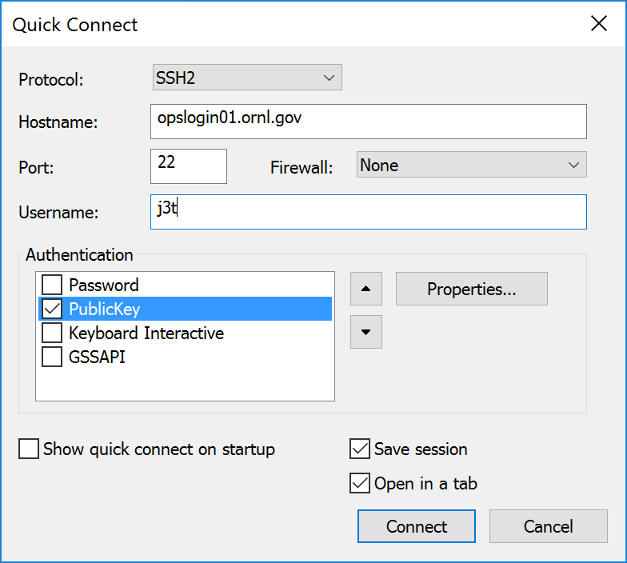
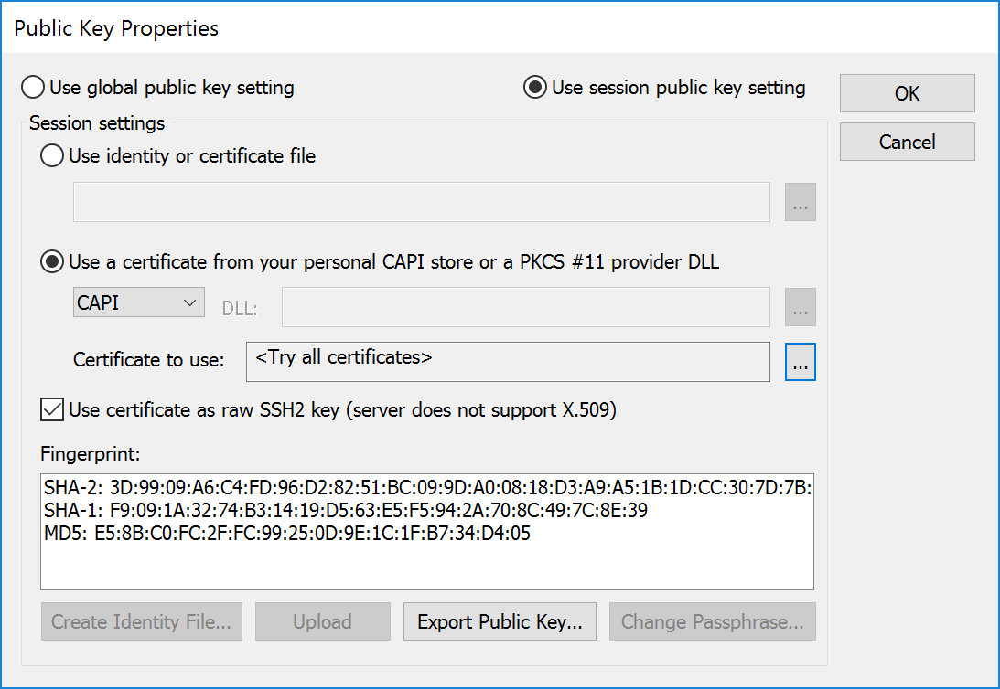
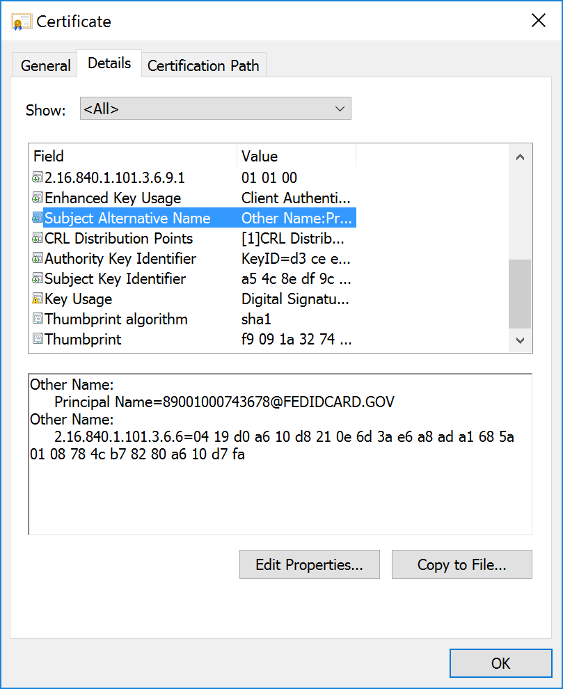
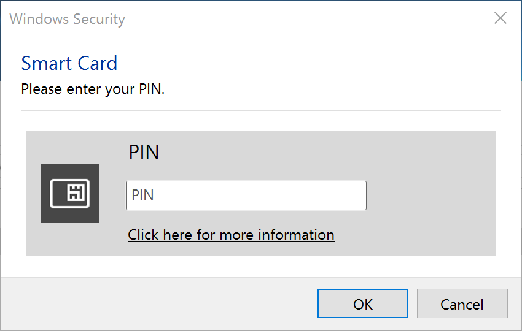

## SSH Authentication with a SmartCard from Windows

### Client Prerequisites
* HSPD-12 or LSSO (site issued) SmartCard badge. **The eToken cannot be used for SSH.**
* You must know your PIN, or visit the badging office to have it reset.
* [Supported](../smartcard-readers) SmartCard reader for your desktop/laptop.
* If you need to use an SSH jump server, you must first request access. See [this](https://portal04.ornl.gov/sites/its/ornllogin/Wiki%20Pages1/JumpServersLookup.aspx) page for the server list.

 

### SecureCRT
1. Install SecureCRT version 8.0 or newer.
	* This is paid commercial software. A 30 day trial can be downloaded from [here](https://www.vandyke.com/download/securecrt/download.html).
	* ITSD staff can request a licensed copy by sending an e-mail to [Spuds-Support@ornl.gov](mailto:Spuds-Support@ornl.gov).
	* Non-ITSD staff can order a licensed copy from [Marketplace](https://market.ornl.net/ORNL/login/ornl_html/purch/purch.html).
2. Insert your SmartCard.
3. Launch SecureCRT.
4. File -> Quick Connect (the dialog may be open by default)
	* Hostname: server-name.ornl.gov (e.g. opslogin01.ornl.gov)
	* Username: your-username
	* Authentication:
		- [ ] Password
		- [X] PublicKey
		- [ ] Keyboard Interactive
		- [ ] GSSAPI  

5. Click Authentication -> PublicKey -> Properties
	* Use session public key setting
	* Use a certificate from your personal CAPI store

6. Click the selection icon next to **Certificate to use:**
	* HSPD-12 badge: The certificate should be named: Firstname Lastname (Affiliate)
	* LSSO badge: The certificate should be named: Lastname, Firstname (username)
	* Highlight each non-expired certificate (one at a time and starting from the top) and click **Properties**
		* Click the **Details** tab
		* Click the **Subject Alternative Name** field
			* **HSPD-12 badge**: The correct certificate will have a principal name of number@FEDIDCARD.GOV
			* **LSSO badge**: The correct LSSO certificate will have a principal name of ucams-username@ornl.gov
	
	* When you have found the correct certificate, ensure that it is highlighted and click **OK**.
7. Click **OK** to close the Public Key Properties.
8. Click **Connect**.
9. Enter your PIN when prompted.  

