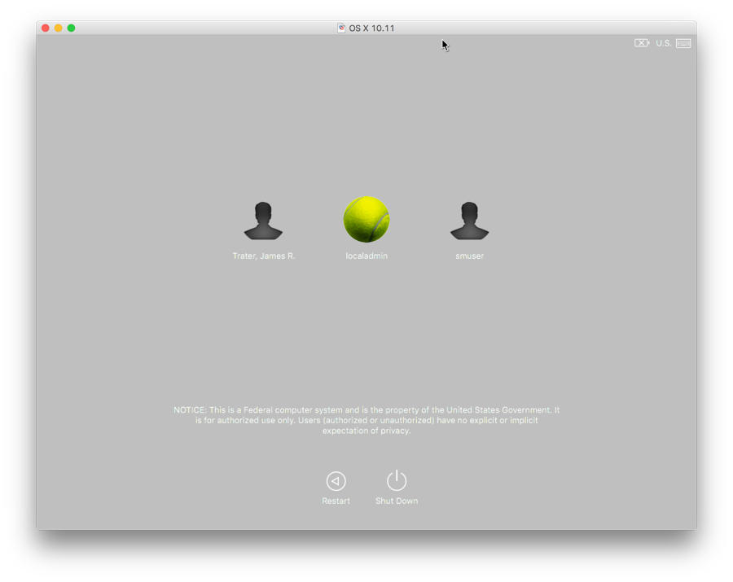
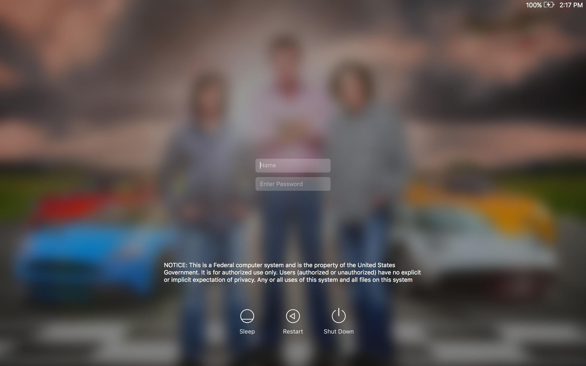
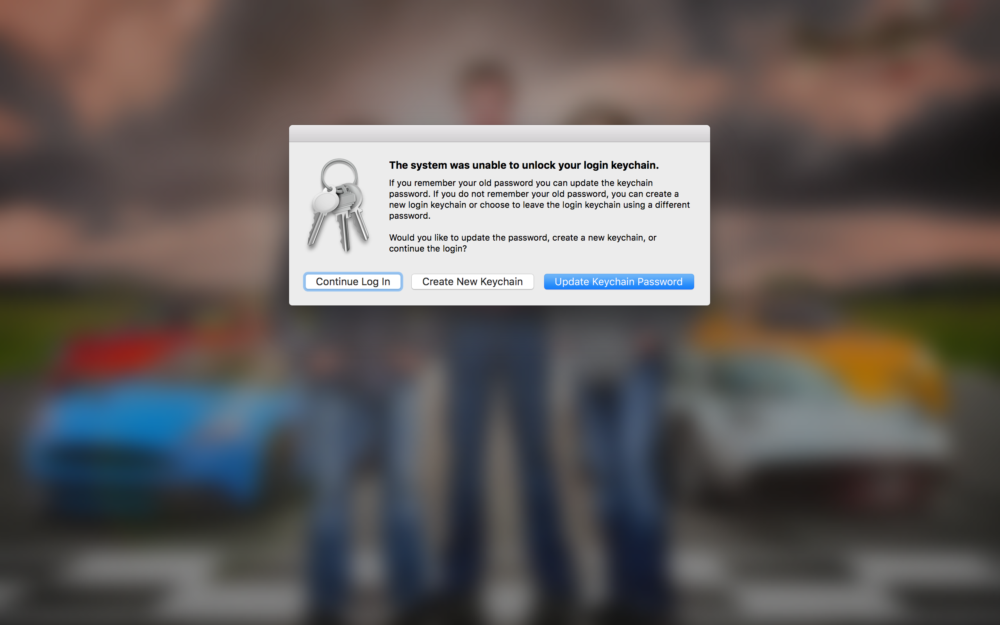
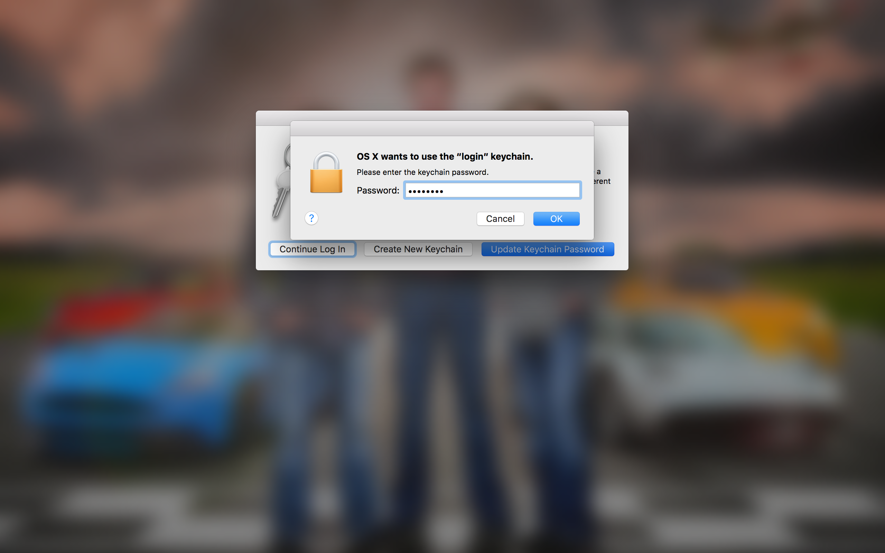
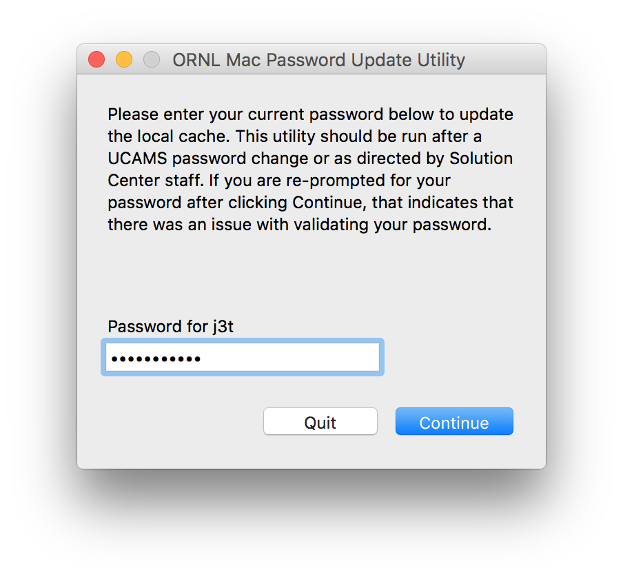

### Before You Begin
1. Visit a [PIN testing station](https://portal04.ornl.gov/sites/its/ornllogin/SitePages/MFAKioskLocations.aspx) and confirm that you know the PIN to your badge. If you do not know the PIN to your badge, visit the badge office in the Visitors Center to get it reset.
2. Visit an enrollment station to get your eToken and set a PIN. If you have forgotten your PIN, visit an enrollment station to re-enroll your token.

 
### Install SmartCard Software

**Important:** Once this software is installed, all UCAMS accounts will be required to use an eToken or physical SmartCard to login to this computer.  
**Important:** This software will be automatically installed on all on-site computers beginning on September 28, 2016.

1. These steps must be performed while physically at ORNL and connected to the wired network.
2. Quit all running applications.
3. Install the [SmartCard Login Plugin](munki://detail-smartcard_NIHAuthPlugin) from the Managed Software Center.
	* Your computer will reboot as part of the install.
4. **If your computer in encrypted with FileVault, you still need to use your UCAMS password to unlock the drive on every (re)boot.**

5. The computer will boot to the login window.
	* You will need to accept the DOE warning banner.

6. **Wait 30 seconds and insert your eToken.**
	* The 30 second waiting period is only needed the first time you login with an eToken.
7. Your account should be recognized within a few seconds and you will be prompted for your PIN.

8. Enter your PIN and press **return**.
9. You may receive a warning about unlocking your keychain.

10. Click **Update Keychain Password**.
11. Enter your UCAMS password and click OK.

12. Your keychain password has now been set to your PIN.

 
### Notes About MFA
* You can use your eToken to elevate privileges or unlock your screen.
* If you remove your eToken, your computer will revert back to using your UCAMS password for screensaver unlock and privilege elevation.

 
### Off Network Login
There are limitations on what MFA methods can be used while off-site/off-network. As a general rule of thumb, you must continue to use the same method you used while at ORNL. Please consult the table below for a detailed breakdown.

| Most recent MFA method you used to login (at the login screen) | MFA methods that can be used while off-site/off-network |
| ------------ | -------------- |
| eToken | eToken or site issued badge |
| site issued badge | eToken or site issued badge |
| HSPD12 badge | HSPD12 badge |

 
### Special Instructions When Changing Your UCAMS Password

You do not need to change your UCAMS password as part of enabling MFA login on your Mac. However, you should follow the steps below the next time you are required to change your UCAMS password. These steps will ensure that your new password is cached to the computer because it is still needed for FileVault and as a fallback for screen unlock and privilege elevation.

1. Connect your Mac to the wired or wireless network.
2. Login with your UCAMS account.
3. Follow the directions in the email to [change](https://portal.ornl.gov/Pages/UpdatePassword.aspx) your UCAMS password.
4. Remove your eToken from the computer.
5. Launch Applications -> ORNL Solution Center -> Utilities -> Password Update.
6. Enter your new UCAMS password and click Continue.

7. Your UCAMS password change is now complete.

 
### Known Issues
* The **Security & Privacy** system preference pane will not unlock with an eToken. You must remove your token and unlock the pane with your password.
* Your wireless connection may not automatically reestablish when coming out of computer sleep mode. The workaround is to manually reconnect to the wireless network.
* Screensaver unlock may not work with an eToken when coming out of computer sleep mode. If you experience difficulties, remove your eToken from the computer and unlock the screen with your UCAMS password.

 
## Advanced Users
---

### Apple Remote Desktop (ARD) Access to a MFA Enabled Mac

ARD access will be disabled by default except to allow remote assistance invitations by the Solution Center. If you need ARD access to your computer, please request a **Smart Card Authentication Enforcement Policy - Mac ARD** exception through the [Device Exception System](http://home.ornl.gov/~dex/prod/). Devices with an approved exception will allow ARD access with a standard username and password, but you will need to explicitly authorize specific users in System Preferences -> Sharing -> Remote Management. You will be allowed to login with a standard username and password from an ARD session; use your PIN to unlock the login keychain.

 
### SSH Access to a MFA Enabled Mac

SSH access will be disabled by default except to allow access by IT accounts. If you need SSH access to your computer, please request a **Smart Card Authentication Enforcement Policy - Mac SSH** exception through the [Device Exception System](http://home.ornl.gov/~dex/prod/). Devices with an approved exception will allow SSH access with a standard username and password, but you will need to explicitly authorize specific users in System Preferences -> Sharing -> Remote Login.

 
### VNC Access to a MFA Enabled Mac

VNC access will be disabled in all circumstances because of security concerns.

 
### Exceptions from MFA Enforcement

If you have a valid business reason why MFA cannot be enforced on your Mac, request a **Smart Card Authentication Enforcement Policy** exception through the [Device Exception System](http://home.ornl.gov/~dex/prod/).

 
### Remote Desktop Client

The Microsoft Remote Desktop Client does not currently support SmartCard passthrough. We are investigating other solutions, but in the interim please vote for this feature on the [user voice](https://remotedesktop.uservoice.com/forums/287834-remote-desktop-for-mac/suggestions/17210378-add-smartcard-authentication-to-windows) site. You may also try using the Remote Desktop client from within a [Citrix](https://ornlaccess.ornl.gov) desktop session.

