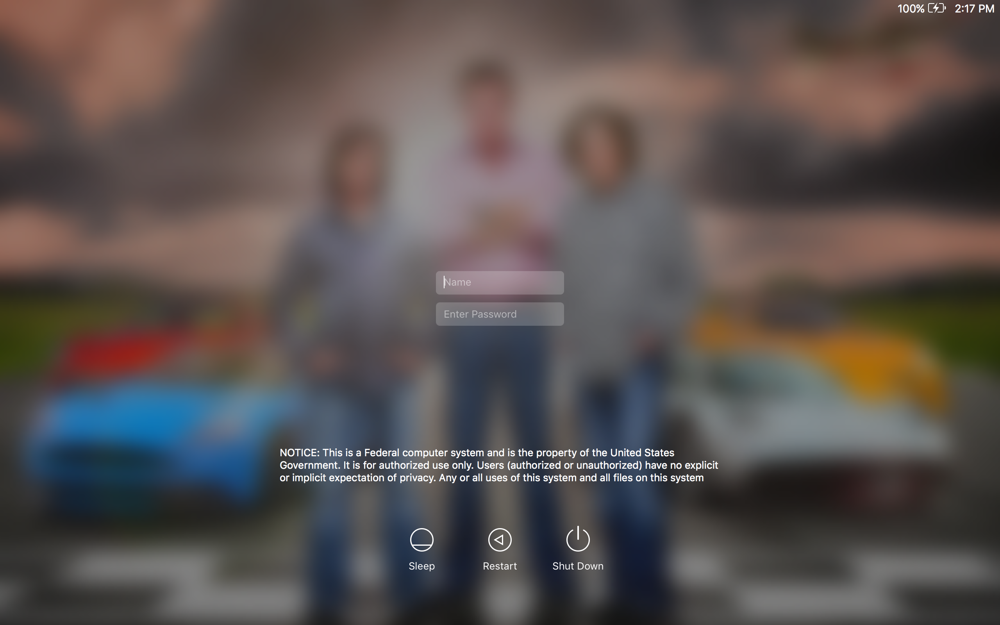

### Before You Begin
1. These steps must be performed while physically at ORNL and connected to the wired network.
2. Quit all running applications.
3. Connect to the wired network.
4. This procedure will require 2 computer reboots and approximately 10 - 15 minutes to complete.
5. ARD and SSH access into your computer will be disabled without a DES exception. Please read the sections below for details.
6. All Active Diretcory primary user accounts will be required to login with MFA after the computer is enrolled.
7. Be sure to remove your Badge/SmartCard from the reader if you are going to walk away from your computer.
8. Read this entire document and follow each step carefully.

 
### OS Prerequisites
* OS X 10.10 (Yosemite) or OS X 10.11 (El Capitan).
	* [OS X 10.11](https://ornl.service-now.com/its/kb_view_customer.do?sysparm_article=KB0010383) is recommended.
	* If you are unsure of the OS version, click the Apple menu (in the top left) -> About This Mac.

 
### MFA Prerequisites
You may use either a USB eToken (recommended) or a physical SmartCard (badge) + SmartCard reader to login. A site issued badge can be used as an emergency backup for your eToken if it is lost or broken.

- [ ] Prerequisites to use a SafeNet USB eToken.
	- [ ] Visit an enrollment station to enroll your token.
	- [ ] If you have forgotten your PIN, visit an enrollment station to re-enroll your token.

- [ ] Prerequisites to use a HSPD-12 or site issued SmartCard badge.
	- [ ] If you have forgotten your PIN, it can be reset at the badge office.
	- [ ] A [supported](mfa/smartcard-readers) SmartCard reader for your desktop/laptop.

 
### Exceptions from MFA Enforcement

If you have a valid business reason why MFA cannot be enforced on your Mac, request a **Smart Card Authentication Enforcement Policy** exception through the [Device Exception System](http://home.ornl.gov/~dex/prod/). If your computer only needs to be excluded for the purpose of ARD or SSH access, please see the relevant sections near the end of this document.

 
### Test Your eToken
1. Quit all running applications.
2. Install the [SmartCard Drivers](munki://detail-smartcard_cssi) from the Managed Software Center.
3. Launch Applications -> Utilities -> Keychain Access.
4. Insert your eToken into a USB port.
5. Click on **My Token** in the left Keychains pane.

6. Click the lock icon to unlock your eToken using your PIN.

7. Repeat the Keychain procedure for all users of the computer.

**Stop!** If you are unable to complete the above steps, do not continue until you are able to view and unlock your eToken.

 
### Test Your Physical SmartCard
1. Quit all running applications.
2. Install the [SmartCard Drivers](munki://detail-smartcard_cssi) from the Managed Software Center.
3. Connect your SmartCard reader to the computer.
4. Launch Applications -> Utilities -> Keychain Access.
5. Insert your SmartCard and wait several seconds.
6. Click on your SmartCard in the left Keychains pane (it will probably contain the word PIV in the name).

7. Click the lock icon to unlock your SmartCard using your PIN.

8. Repeat the Keychain procedure for all users of the computer.

**Stop!** If you are unable to complete the above steps, do not continue until you are able to view and unlock your card.

 
### Enforce MFA Login

**Important:** Once this change is made, all UCAMS accounts will be required to use an eToken or SmartCard to login to this computer.

1. Remove your eToken or SmartCard from the reader.
2. Quit all running applications.
3. Install the [SmartCard Login Plugin](munki://detail-smartcard_NIHAuthPlugin) from the Managed Software Center.
4. **If your computer in encrypted with FileVault, you still need to use your UCAMS password to unlock the drive on every (re)boot.**

5. The computer will boot to the login window.
	* You will need to accept the DOE warning banner.

6. **Make sure that you are connected to the wired network.**
7. **Wait 30 seconds and insert your eToken or SmartCard.**
	* The 30 second waiting period is only needed the first time you login with an eToken or SmartCard.
8. Your account should be recognized within a few seconds and you will be prompted for your PIN.

9. Enter your PIN and press **return**.
10. You may receive a warning about unlocking your keychain.

11. Click **Update Keychain Password**.
12. Enter your UCAMS password and click OK.

13. Your keychain password has now been set to your PIN.

 
---

 
### Notes About MFA Enforcement
* You can use your eToken or SmartCard to elevate privileges or unlock your screen.
* If you remove your eToken or SmartCard, your computer will revert back to using your UCAMS password for screensaver unlock and privilege elevation.
* Always remove your SmartCard before walking away from your computer.

 
### Off Network Login
There are limitations on what MFA methods can be used while off-site/off-network. As a general rule of thumb, you must continue to use the same method you used while at ORNL. Please consult the table below for a detailed breakdown.

| Most recent MFA method you used to login (at the login screen) | MFA methods that can be used while off-site/off-network |
| ------------ | -------------- |
| eToken | eToken or site issued badge |
| site issued badge | eToken or site issued badge |
| HSPD12 badge | HSPD12 badge |

 
### Known Issues
* The **Security & Privacy** system preference pane will not unlock with an eToken or SmartCard. You must remove your card or token and unlock the pane with your password.
* Your wireless connection may not be automatically reestablish when coming out of sleep and using a password to unlock the screensaver. The workaround is to manually reconnect to the wireless network (e.g. ORNLWPA) or to unlock your screen with either your eToken or SmartCard.
* Screensaver unlock may not work with an eToken or SmartCard when coming out of computer sleep mode. If you experience difficulties, remove your eToken or SmartCard from the reader and unlock the screen with your UCAMS password.

 
### Apple Remote Desktop (ARD) Access to a MFA Enabled Mac

ARD access will be disabled by default except to allow remote assistance invitations by the Solution Center. If you need ARD access to your computer, please request a **Smart Card Authentication Enforcement Policy - Mac ARD** exception through the [Device Exception System](http://home.ornl.gov/~dex/prod/). Devices with an approved exception will allow ARD access with a standard username and password, but you will need to explicitly authorize specific users in System Preferences -> Sharing -> Remote Management. You will be allowed to login with a standard username and password from an ARD session; use your PIN to unlock the login keychain.

 
### SSH Access to a MFA Enabled Mac

SSH access will be disabled by default except to allow access by IT accounts. If you need SSH access to your computer, please request a **Smart Card Authentication Enforcement Policy - Mac SSH** exception through the [Device Exception System](http://home.ornl.gov/~dex/prod/). Devices with an approved exception will allow SSH access with a standard username and password, but you will need to explicitly authorize specific users in System Preferences -> Sharing -> Remote Login.

 
### VNC Access to a MFA Enabled Mac

VNC access will be disabled in all circumstances because of security concerns.

 
### Remote Desktop Client

The Microsoft Remote Desktop Client does not currently support SmartCard passthrough. We are investigating other solutions, but in the interim please vote for this feature on the [user voice](https://remotedesktop.uservoice.com/forums/287834-remote-desktop-for-mac/suggestions/17210378-add-smartcard-authentication-to-windows) site. You may also try using the Remote Desktop client from within a [Citrix](https://ornlaccess.ornl.gov) desktop session.

 
### Special Instructions When Changing Your UCAMS Password

You do not need to change your UCAMS password as part of enabling MFA login on your Mac. However, you should follow the steps below the next time you are required to change your UCAMS password. These steps will ensure that your new password is cached to the computer because it is still needed for FileVault and as a fallback for screen unlock and privilege elevation.

1. Connect your Mac to the wired or wireless network.
2. Login with your UCAMS account.
3. Follow the directions in the email to [change](https://portal.ornl.gov/Pages/UpdatePassword.aspx) your UCAMS password.
4. Remove your eToken or SmartCard from the reader.
5. Launch Applications -> ORNL Solution Center -> Utilities -> Password Update.
6. Enter your new UCAMS password and click Continue.

7. Your UCAMS password change is now complete.
 

