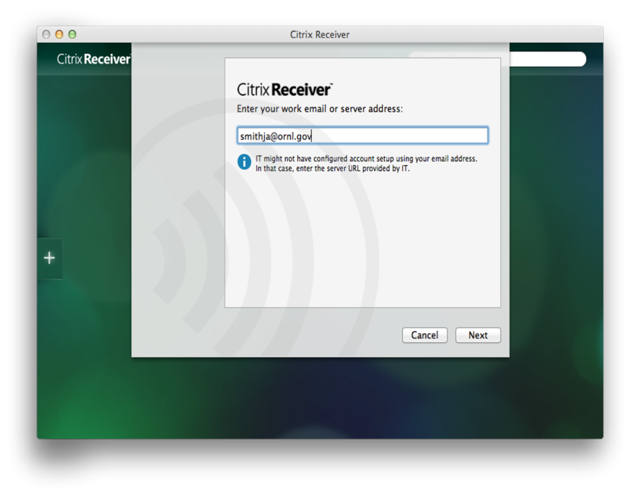
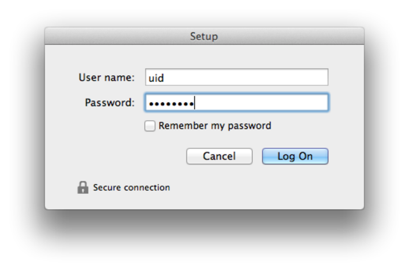
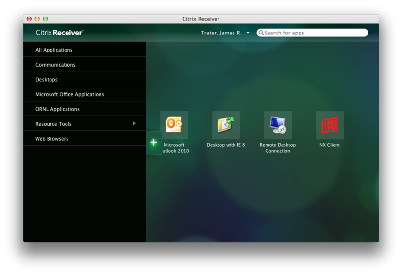
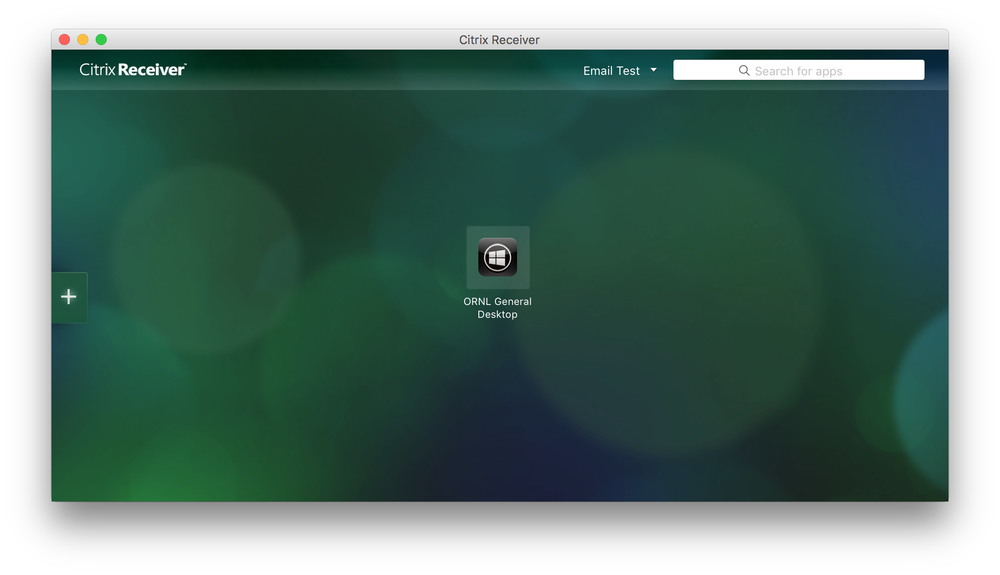
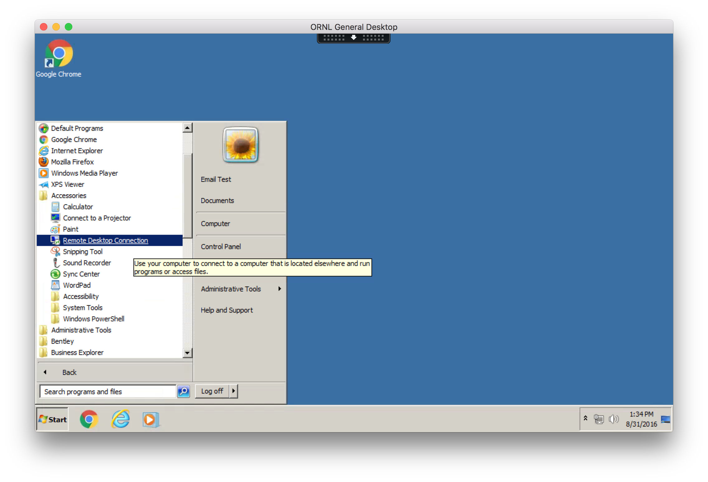
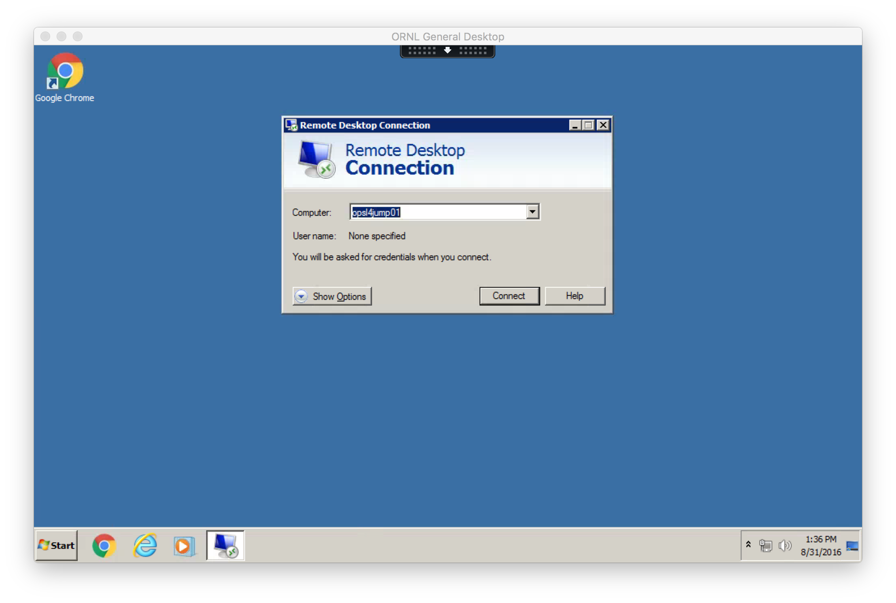
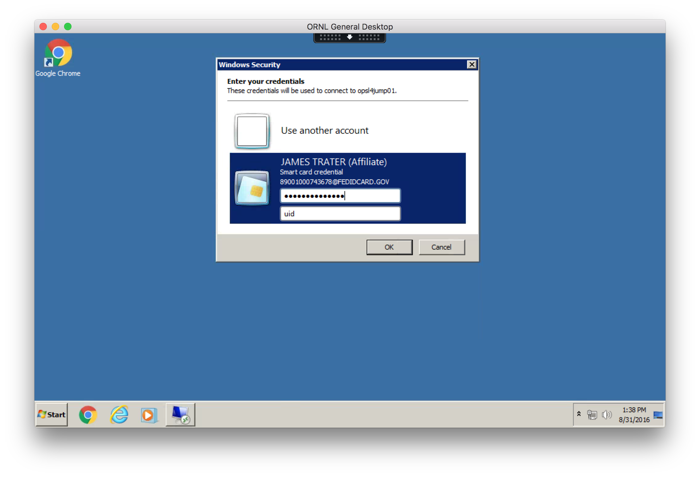

### Client Prerequisites
* HSPD-12 or LSSO (site issued) SmartCard badge.
* You must know your PIN (this can be reset at the badging office).
* [Supported](mfa/smartcard-readers) SmartCard reader for your computer.

 
### Launch Citrix Receiver
1. Launch **Applications** -> **Citrix Receiver**
2. The first time you launch Receiver you will be prompted for your e-mail address. Enter your ORNL e-mail address ( e.g. smithja@ornl.gov ) and click Next.

3. Enter your 3 character UCAMS username and password when prompted.

4. Click the plus ( + ) sign on the left side of the screen to add application launch icons to the receiver. Applications will also be added to your ~/Applications folder and can be launched from there without first opening receiver and can also be dragged to the Dock.

5. Add a launcher for **ORNL General Desktop** found under **All Applications**.
6. Verify that your SmartCard is in the reader **before** launching the desktop session within Citrix.
7. Launch **ORNL General Desktop**.

8. Launch **Remote Desktop Connection** found in Programs -> Accessories.

9. Enter the hostname for the jump server you wish to connect to.

10. Enter your SmartCard PIN and jump server username.

