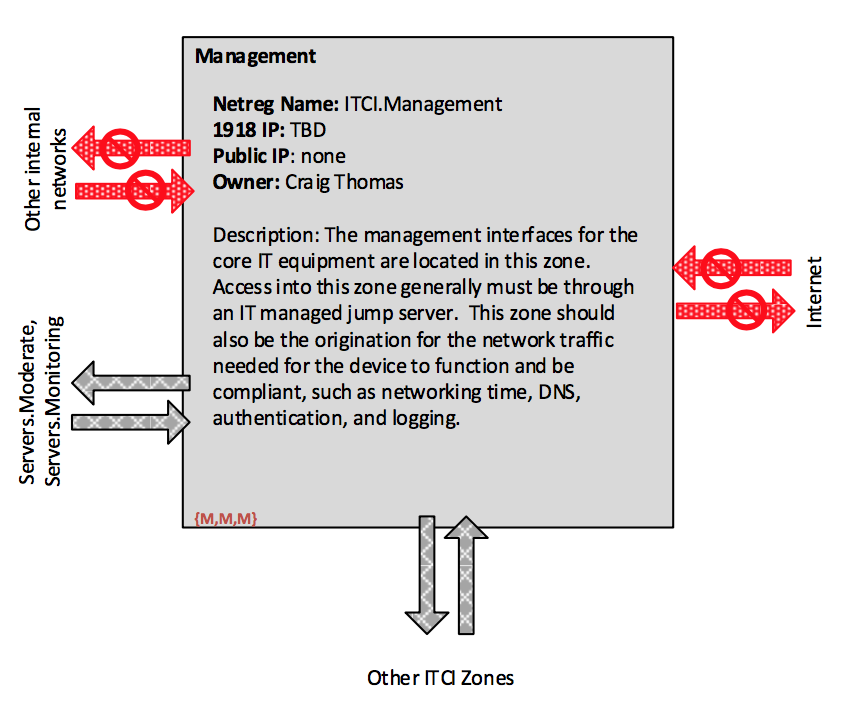

***ORNL Internal Use Only***

***DRAFT FOR COMMENT****

-----------

# Topics
* [Overview](#overview)
* [Authentication in ITCI](authentication-in-itci)
* [ITCI Network Environments](itci-network-environments)
    * [ITCI](#itci)
    * [ITCI.Management](itci-management)

# Overview

The IT Core Infrastructure (ITCI) Enclave is designed to hold primarily the core networking gear for IT services, such as the core router, the border router, the border firewall, and the PZ firewall.  Devices registered in ITCI must be managed by ITSD (Type 1), only IT Networking staff are permitted to register devices in the ITCI, and devices registered to ITCI are permitted to have networking interfaces in any network segment.  

# Authentication in ITCI

All accounts in ITCI are considered privileged accounts, used for management and administration of core IT infrastructure.  These accounts are  indirectly managed through UCAMS, primarily as Other Logins for SecurID or for other multifactor authentication tools.  Network acess to the management interface for ITCI devices must be through an IT managed jump server (in Servers.Moderate) which enforces Level 4 authentication with a UCAMS IT privileged account.  From that jump server, authorized users may access the management console for devices.  Where feasible, management console authentication should be multifactor (Level 3 or better), such as using SecurID.  As a mechanism to aid in intrusion detection, the usernames for management interface authentication should only be used in the ITCI enclave, consistent with the requirement that a given credential should be used in no more than one Enclave.  

# ITCI Network Environments

ITCI consists of two network environments: the Enclave itself, and a zone for the management intefaces of the devices itself.  

&&&&& BEW: Do we need more environments than this?

## ITCI

The ITCI Enclave is itself a network environment which has subnets assigned to it.  The device interfaces registered at the Enclave level are for enabling network traffic between other network environments (including enabling traffic to the Internet).  Only IT Networking staff can register interfaces in the ITCI network environment.

No flows are defined for this network environment.  The IT networking staff will determine the structure of this environment and what kinds of traffic should be permitted.  

## ITCI.Management

ITCI.Management is for the management interfaces for IT Core Infrastructure systems as well as for the communication channels needed for equipment functioning and logging.  For example, log traffic from the networking gear should originate from ITCI.management and transit to Servers.Monitoring.  The networking traffic associated networking gear needs for time, DNS, and authentication (RADIUS) should also originate from this network zone.  Addresses in this zone should be RFC 1918.  

