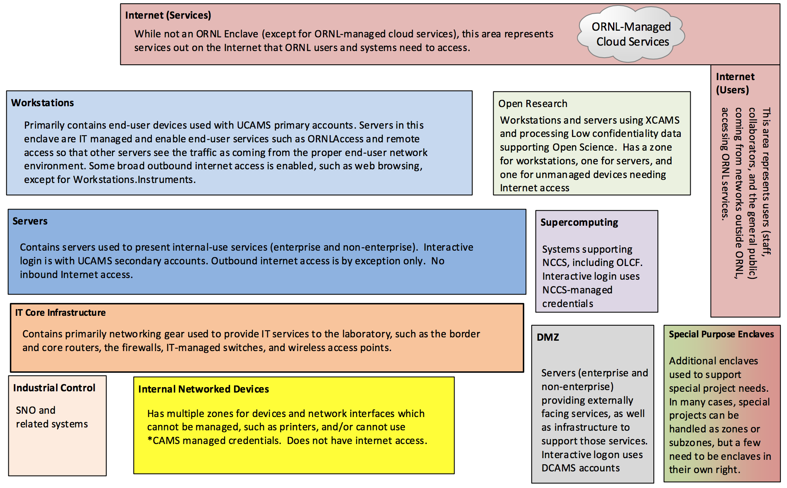

***ORNL Internal Use Only***

-----------

**Summary**: This document describes the Enclaves that are part of the to-be network and credential architecture.  The enclaves are described at a high level in this document with links to more detailed documentation with zone information.  

As part of the evolution of the network segmentation effort and in support of the Multifactor Authentication (MFA) project, the plan is to use to the following unclassified enclaves:

The Internet is shown on this diagram for reference and to illustrate network traffic patterns in other diagrams.  However, external systems which hold ORNL data or where ORNL is responsible for some controls may be treated as part of one or more zones in a Cloud enclave.  For example, ORNL's use of Service Now may be treated as a Cloud.ServiceNow zone for purposes of documenting and testing controls.  

Additional enclaves may be needed to handle special systems or needs, such as the Health Sciences initiative.  At a minimum, such special cases will be zones or subzones (surrounded by a firewall or equivalent protection).  Whether or not they are their own Enclave is determined by the C&A approach.  Moderate systems that require interactive login from external parties (such as FUSEnet and Moderate CADES) are not currently placed in this architecture and are an open issue as of this writing (see [Open Questions](open-questions)).  

Additional information about each of these Enclaves and their zones is at the links below:

* [DMZ](netseg/dmz-enclave)
* [Servers](netseg/servers-enclave)
* [Workstations](netseg/workstations-enclave)
* [Open Research](netseg/open-research-enclave)
* [IT Core Infrastructure](netseg/it-core-infrastructure-enclave)
* [Internally Networked Devices](netseg/internally-networked-devices-enclave)
* [Industrial Control Systems](netseg/industrial-control-systems-enclave)
* [Supercomputing](netseg/supercomputing-enclave)
* [Cloud](netseg/cloud-enclave)
* Special Purpose Enclaves
    * [Visitor](netseg/visitor-network)
    * [HDSI](netseg/hdsi-enclave)
